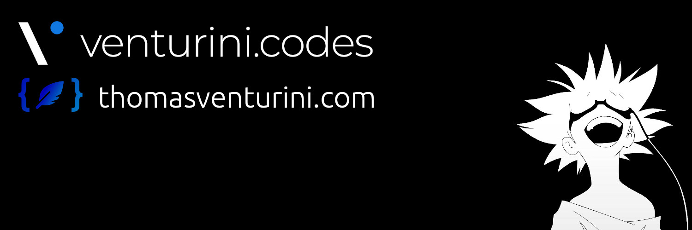

Hey there 👋

I'm Thomas Venturini, a software developer from the **[Austria 🇦🇹](https://en.wikipedia.org/wiki/Austria)**, founder of [venturini.codes](https://venturini.codes) and blogging at [thomasventurini.com](https://thomasventurini.com). I'm interested in web and game development.

# 📬 Get in touch

* Web: [thomasventurini.com](https://thomasventurini.com)
* LinkedIn: [linkedin.com/in/tjventurini](https://www.linkedin.com/in/tjventurini/)
* Twitter: [@tjventurini](https://twitter.com/tjventurini)
* YouTube: [Thomas Venturini's Channel](https://www.youtube.com/channel/UChUOhfzTGv3vE6B9tJ6g9Eg)